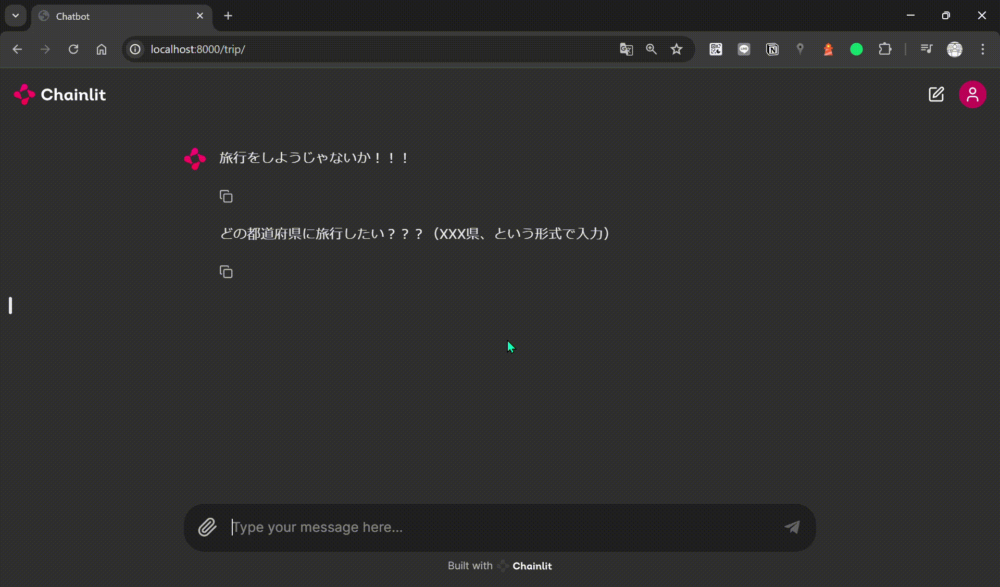
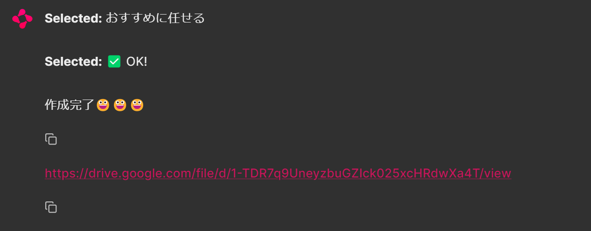
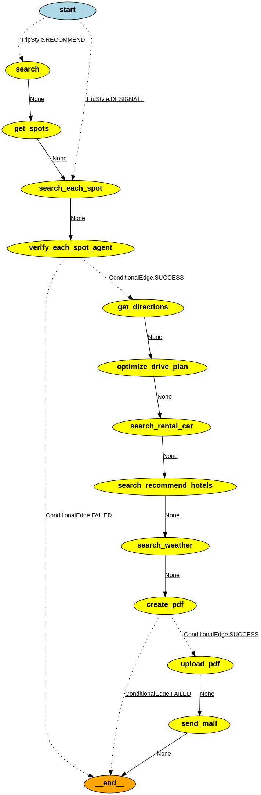
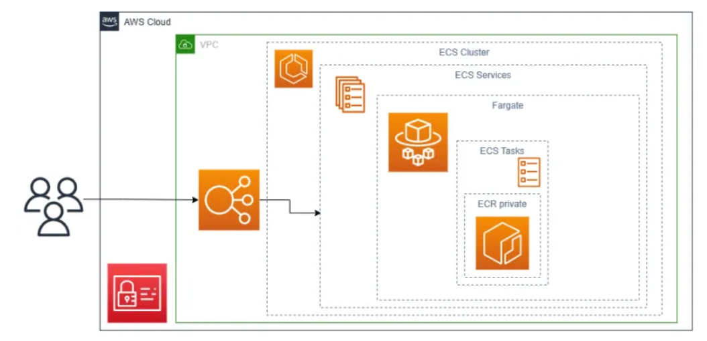

# 旅行手助けツール
このリポジトリは、特定の都道府県のおすすめスポットをはじめ、乗り換え経路や現地のレンタカー店の情報などを取得し、PDFに出力することを行ってくれるツールです。（**現在も作成中の機能があり、随時更新予定です**）

langgraphをベースにして、各機能をNodeとして作成しています。
詳しくは、後述する「主な利用技術」を参考していただければと思います。

※個人の趣味と技術理解・検証が作成した主な目的で、サービス化といったことは全く考えていません。
実装面で、langgraphを利用される方の参考になればと思い、公開リポジトリにしちゃいました！

[完成サンプルPDF](./%E7%A7%8B%E7%94%B0%E7%9C%8C%E3%81%8A%E3%81%99%E3%81%99%E3%82%81%E3%82%B9%E3%83%9D%E3%83%83%E3%83%88%E9%9B%86_20240719194039.pdf)

## 画面
#### 操作-PDF作成開始まで

#### PDF作成完了後


## 主なフォルダ構成
- `aws-stack/aws_stack`：インフラ定義
- `aws-stack/server`：アプリケーション関連のコード
- `figure`：README.mdで使う画像

## 主な利用技術
- [chainlit](https://github.com/Chainlit/chainlit)
  - チャット画面作成
- [GPT:`gpt-4o-mini-2024-07-18`](https://platform.openai.com/docs/models/gpt-4o-mini-2024-07-18)
  - PDFの内容検証Ⅰ
- [Claude:`3.5 Sonnet`](https://docs.anthropic.com/en/docs/welcome)
  - 乗り換え案内の画像から情報取得
- [LangGraph](https://python.langchain.com/v0.1/docs/langgraph/)
  - 各情報取得からPDFの作成、アップロードまでの処理構成を構築
- [llamaIndex](https://www.llamaindex.ai/)
  - Webサイトに対するクエリによる検索
- [PyMuPDF4LLM](https://pymupdf4llm.readthedocs.io/en/latest/)
  - PDFの内容検証Ⅱ
- [Tavily API](https://tavily.com/)
  - 各スポットの関連サイト取得
- [Google Custom Engine](https://programmablesearchengine.google.com/intl/ja_jp/about/)
  - Googleの検索結果をPDFに添付
- [PlayWright](https://playwright.dev/docs/screenshots)
  - スクリーンショット撮影
- [ReportLab](https://www.reportlab.com/)
  - PDF作成
- [service accountの利用](https://www.reportlab.com/)
  - 作成PDFをドライブにアップロードするために作成（任意のサービスアカウントをGoogle Cloudのコンソールから作成）
  - `trip-pdf-sa.json`というファイルを、`aws-stack/server/app`に配置

## アプリの構成概要


#### 構成詳細
以下のエージェントを定義
1. 指定した都道府県の観光スポットを取得
2. 取得スポットの検証検証
   1. 各スポットの紹介文が取得可能か
   2. 各スポットの緯度・経度が取得可能か
   3. 各スポットの詳細に含まれる画像が表示可能か
   4. 手順1-3の各検証についていずれも問題なければスポットして採用
3. 現地までの経路調査
   1. 乗り換え案内のサイトの経路情報をスクリーンショット撮影
   2. 手順1のスクリーンショットのOCRを実施し、文章取得
4. ドライブ順の算出
   1. 各スポットの緯度・経度からスポット間の距離を計算し、時速40km/hで移動した場合の所要時間を算出
   2. 算出した所要時間と各スポットの滞在時間を1時間と仮設定して、旅程表を構成
5. レンタカー店舗数の確認
   1. ターミナル（新幹線停車駅・空港）の近くのレンタカーに関する情報を取得
6. 現地のおすすめまたはお安いホテルが掲載されたページのリンクを設定
7. 昨年の現地の天気や気温の情報が掲載されたページのリンクを設定
8. PDF作成
9. PDFの内容検証
10. PDFをGoogle Driveへアップロード

## 環境構築
- 開始
  - App（Ubuntu）
    ```
    python -m venv trip_ubuntu
    source trip_ubuntu/bin/activate
    pip install -r requirements.txt --no-warn-script-location
    ```
  - AWS CDK（インフラ）
    ```
    cd aws-stack
    source .aws-stack-venv/Scripts/activate
    cdk deploy
    ``` 
- 終了
    ```
    deactivate
    ```

## アプリケーション（ローカル）起動
uvicornコマンドでアプリケーションを起動
  ```
  cd aws-stack/server/app
  uvicorn chainlit_main:app --reload
  ```

## AWS上の構成
ALBやECSを構築します。また機密情報については、Secret Managerを利用します。
[参考資料（Medium）](https://medium.com/gitconnected/develop-and-deploy-a-generative-ai-application-using-openai-langchain-fastapi-docker-and-aws-4efb153b369e)

